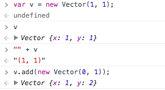

### Static methods, moving objects and Newton's first Law

We start to immerse into game physics today with adding 2D objects to our simulation and let them move in a straight line. New details of JavaScript OOP will also show up, and we will creatively use the prototype system to inject and remove debug code at run-time.

### Space Objects

Protosun is a 2D game. We will need to do some math so we implement a two dimensional [vector space](http://en.wikipedia.org/wiki/Vector_space). A point in that space is called vector, but a vector is a bit more than a point: vectors can be added together and multiplied with a scalar.

#### vector.js:

```javascript
function Vector(x, y) {
  this.x = x;
  this.y = y;
}

Vector.prototype.add = function (another) {
  this.x += another.x;
  this.y += another.y;
  return this;
};

Vector.prototype.multiply = function (scalar) {
  this.x *= scalar;
  this.y *= scalar;
  return this;
};

Vector.prototype.toString = function () {
  return "(" + this.x + ", " + this.y + ")";
};
```

It is not possible in JavaScript to define operators on objects so we have to use methods. Both `add` (`+=`) and `multiply` (`*=`) works in place, modifying the object.

> Returning `this` after the calculation allows us to chain calls like `w.add(s).multiply(z)` which is considered cool nowadays. Plus, it mimics the original behavior of in-place arithmetic operators.

The `toString` method is predefined in `Object`, it will be automatically called when a text representation of the object is needed, e.g.: when we add the object to a string:



#### spaceobject.js:

```javascript
function SpaceObject(pos, v) {
  this.pos = pos;
  this.v = v;
  this.id = SpaceObject.prototype.getNextId();
}
```

The `SpaceObject` is just a point in space which moves with a specific velocity. You may remember from the school that velocity is also a vector.

A unique id is generated for every `SpaceObject` at creation. `getNextId` is "static", which just means that it doesn't access `this` so it can be called using the prototype, without an object.

> As we are in the constructor, `this` already points to a `SpaceObject`, so `this.id = this.getNextId()` would work the same.

More interesting is the `nextId` property which is added to the prototype, so it will be shared, just like a static property in classic OOP:

```javascript
SpaceObject.prototype.nextId = 1;

SpaceObject.prototype.getNextId = function () {
  var id = "SO" + SpaceObject.prototype.nextId;
  SpaceObject.prototype.nextId += 1;
  return id;
};
```

### Newton appears on the scene ###

> Newton's first law of motion: *An object either remains at rest or continues to move at a constant velocity, unless acted upon by an external force.*

As we haven't implemented forces yet, this simply means that in every step we have to change the position of the object with its velocity. (We do not bother with unit systems for now):

```javascript
SpaceObject.prototype.oneStep = function () {
  this.pos.add(this.v);
};
```

### Let's Simulate! ###

`Simulation` stores references to `SpaceObjects` in an array. In `oneStep` it goes through the array calling `oneStep()` on each object.

```javascript
Simulation.prototype.addSpaceObject = function (spaceObject) {
  this.spaceObjects.push(spaceObject);
};

Simulation.prototype.oneStep = function () {
  var length = this.spaceObjects.length;
  for (var j = 0; j < length; j++) {
    this.spaceObjects[j].oneStep();
  }
};
```

> I have modified this a bit from the previous version where `spaceObjects` was `Object`, not `Array`. Storing them in an object may be more convenient because it allows us both sequencial and random (based on the `SpaceObject` id) access. But it is at least [20x slower](https://jsperf.com/performance-of-array-vs-object/142) than an array so I gave way to the desire of (premature?) optimization.


